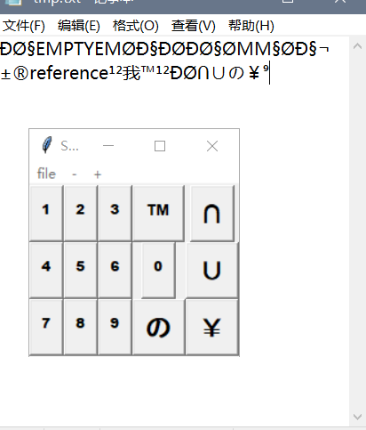

To insert a Unicode character efficiently, customize your unicode_character.csv file and replace ordinary keyboards. The Symbol Typer has below features:

**Foreground**: Symbol Typer is always the top-level window

**Changeable**: to adjust keyboard size ("-", "+" buttons)

**Customized**: save your frequently-used unicode characters in a utf-8 .csv,  rowColumn = *m \* n*. (press "file" button to change current char set)

